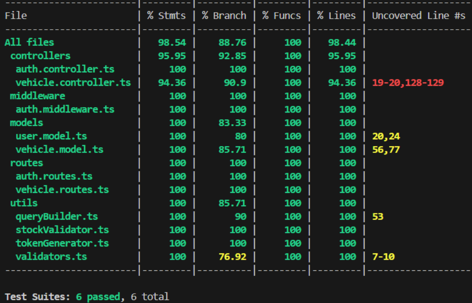

# 🏎️ CarNest: Premium Dealership Management System

A sophisticated, full-stack vehicle inventory and dealership management platform. CarNest is designed from the ground up using **Test-Driven Development (TDD)** to ensure reliability and scalability. The system features a robust RESTful API backend for handling vehicle inventories, user authentication, and purchasing logic, seamlessly integrated with a premium, modern React frontend.


---

## 📖 Table of Contents

- [About The Project](#-about-the-project)
- [Key Features](#-key-features)
- [Technology Stack](#-technology-stack)
- [System Architecture](#-system-architecture)
- [Development Methodology (TDD)](#-development-methodology-tdd)
- [Getting Started](#-getting-started)
- [API Reference](#-api-reference)
- [Testing](#-testing)
- [License](#-license)

---

## 🌟 About The Project

CarNest empowers car dealerships to easily manage their fleets while offering customers a stunning browsing and purchasing experience.

It handles everything from secure user registration and role-based routing (`admin` vs `customer`) to complex inventory tracking. When a customer purchases a vehicle, the stock automatically decreases. Admins have dedicated access to restock vehicles, edit listings, and manage the entire platform.

---

## ✨ Key Features

### 💻 Frontend (Client Experience)

- **Premium User Interface**: Built with modern web design principles including glassmorphism, dark themes, and smooth micro-animations.
- **Dynamic Browsing**: Customers can filter vehicles by make, model, price, and category in real-time.
- **Admin Dashboard**: A secure, centralized hub for dealership owners to add new inventory, update pricing, and restock existing vehicles.
- **State Management**: Highly optimized client-side state handling utilizing custom stores (e.g., `authStore.ts`, `adminStore.ts`).

### ⚙️ Backend (Server Operations)

- **Secure Authentication**: End-to-end JWT integration with bcrypt password hashing.
- **Role-Based Access Control (RBAC)**: Strict separation of concerns. Only admins can modify inventory; customers can only browse and purchase.
- **Advanced SQL Querying**: Custom-built SQL query builder ensuring highly flexible search capabilities while preventing SQL injection.
- **Data Validation**: Strict runtime schema validation using Zod for all incoming requests.

---

## 🛠 Technology Stack

### Backend

- **Runtime:** Node.js + Express.js
- **Language:** TypeScript
- **Database:** PostgreSQL (Using raw `pg` queries—no ORMs used for maximum performance and control)
- **Security & Auth:** JSON Web Tokens (JWT), Bcrypt, Zod
- **Testing:** Jest, Supertest

### Frontend

- **Framework:** React 19 + Vite
- **Styling:** Tailwind CSS + custom glassmorphism utilities
- **Routing:** React Router / TanStack Router

---

## 📐 System Architecture

CarNest relies on a modular, decoupled architecture:

1. **Routing Layer**: Intercepts HTTP requests and passes them through Authentication and RBAC middleware.
2. **Controller Layer**: Handles business logic, orchestrating requests between the client and database.
3. **Model Layer**: Directly interacts with PostgreSQL using parameterized, raw SQL queries to ensure maximum security.
4. **Validation Layer**: Zod schemas act as a strict gateway, rejecting malformed data before it ever hits the database.

---

## 🧪 Development Methodology (TDD)

This platform was rigorously developed using the **Red-Green-Refactor** cycle of Test-Driven Development.

1. **🔴 RED**: We write failing unit and integration tests based on business requirements.
2. **🟢 GREEN**: We implement the minimum required logic to make the test pass.
3. **🔵 REFACTOR**: We optimize the code structure, extract reusable utilities (like our custom `QueryBuilder`), and ensure all tests remain green.

This approach ensures that critical functions like inventory reduction during purchases, JWT verification, and SQL query generation are 100% reliable.

---

## 🚀 Getting Started

### Prerequisites

- Node.js (v18+)
- A local or cloud PostgreSQL database instance
- Git

### Installation

1. **Clone the repository:**

   ```bash
   git clone https://github.com/Kishan-jethloja/CarNest.git
   cd CarNest
   ```

2. **Backend Setup:**

   ```bash
   cd backend
   npm install

   # Duplicate the environment template
   cp .env.example .env
   ```

   _Update the `.env` file with your PostgreSQL `DATABASE_URL` and `JWT_SECRET`._

3. **Run the Backend:**

   ```bash
   npm run dev
   ```

   _The server will automatically initialize the required database tables on startup._

4. **Frontend Setup:**
   ```bash
   cd ../frontend
   npm install
   npm run dev
   ```
   _The client will be available at `http://localhost:5173`._

---

## 🔌 API Reference

**Base URL**: `http://localhost:5000/api`

### Auth Endpoints

- `POST /auth/register` - Create a new customer account
- `POST /auth/login` - Authenticate and receive a JWT

### Vehicle Endpoints

_(Requires `Authorization: Bearer <token>`)_

- `GET /vehicles` - Fetch all available vehicles
- `GET /vehicles/search` - Query vehicles by price, make, model, etc.
- `POST /vehicles/:id/purchase` - Purchase a vehicle (Customer)
- `POST /vehicles` - Add new vehicle (Admin)
- `PUT /vehicles/:id` - Update vehicle details (Admin)
- `DELETE /vehicles/:id` - Remove a vehicle (Admin)
- `POST /vehicles/:id/restock` - Increase vehicle inventory (Admin)

---

## 🚥 Testing

CarNest includes a comprehensive test suite covering models, utilities, and endpoints. To run the tests (which are configured to mock database connections for speed and safety):

```bash
cd backend
npm run test -- --coverage
```

### Test Coverage

Here is the snapshot of our 100% green test coverage report:



---

_Built with passion by [Kishan Jethloja](https://github.com/Kishan-jethloja)._
